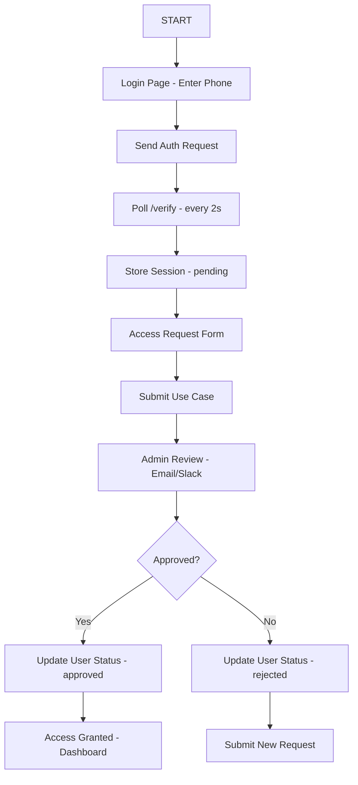
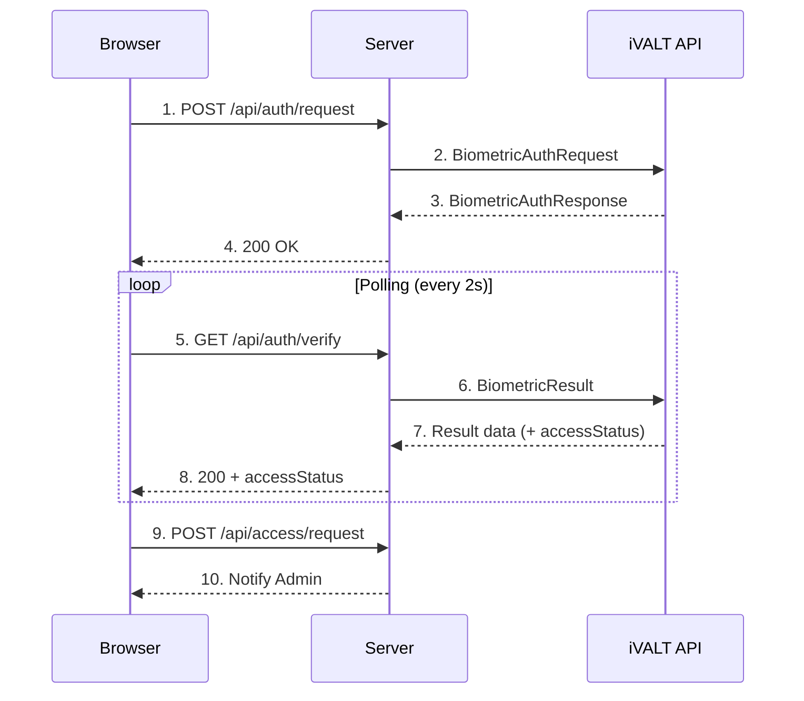
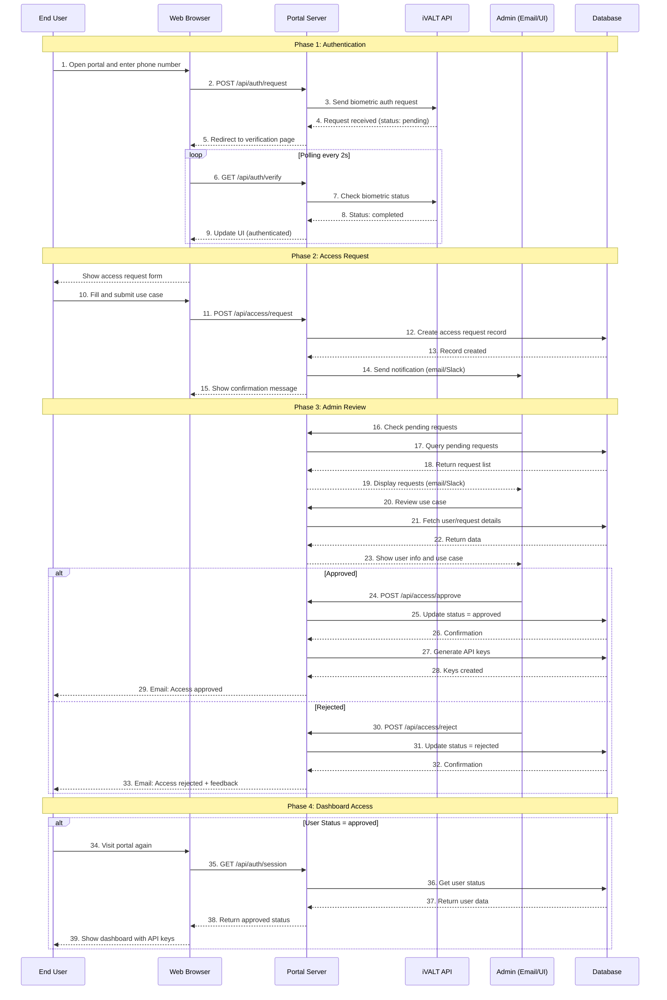
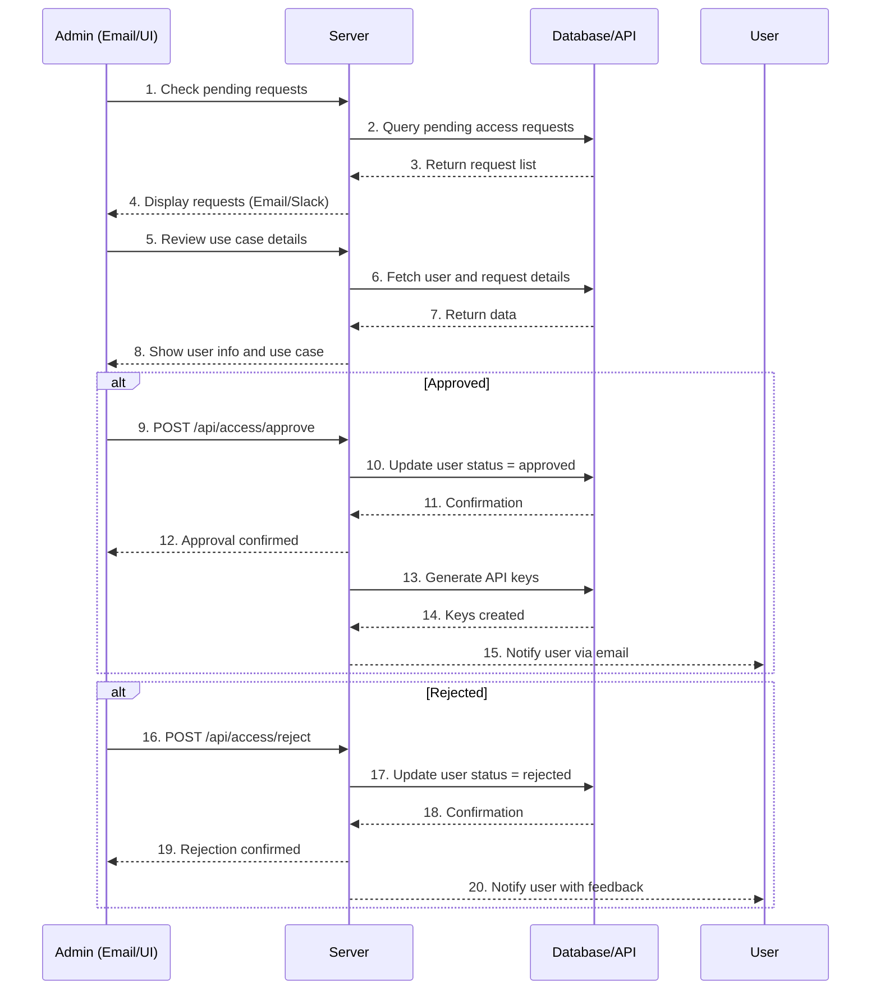

# User Journey Flow - iVALT Developer Portal

This document describes the complete user journey through the iVALT Developer Portal, including the new access control workflow.

## Overview

The iVALT Developer Portal implements a three-step authentication process:
1. **Biometric Authentication** - Verify user identity via iVALT mobile app
2. **Access Approval** - Admin review of use case before API access is granted
3. **Dashboard Access** - User can manage API keys and view documentation

## Flow Diagram

### User Journey Flow

## Step-by-Step User Journey

### Step 1: Authentication

| Phase | Action | Details |
|-------|--------|---------|
| 1.1 | Access Portal | Navigate to portal URL (e.g., `https://portal.ivalt.com`) |
| 1.2 | Enter Phone | Input mobile number with country code |
| 1.3 | Request Auth | Click "Continue" to send biometric request |
| 1.4 | Approve Push | Open iVALT app and approve the notification |
| 1.5 | Polling | System polls `/api/auth/verify` every 2 seconds |

**Outcome:** Session created with `accessStatus: "pending"`

### Step 2: Access Request

| Phase | Action | Details |
|-------|--------|---------|
| 2.1 | Redirect | Automatically redirected to `/access/request` |
| 2.2 | Describe Use Case | Fill in form explaining intended API usage |
| 2.3 | Submit | Click "Submit Request" |
| 2.4 | Confirmation | See confirmation screen with next steps |

**Outcome:** Access request record created, admin notified

### Step 3: Admin Review

| Phase | Action | Details |
|-------|--------|---------|
| 3.1 | Notification | Admin receives email/SMS about new request |
| 3.2 | Review | Admin checks use case in database or admin panel |
| 3.3 | Decision | Admin approves or rejects the request |
| 3.4 | Update | User's `status` field updated to `approved` or `rejected` |

**Outcome:** User status changes accordingly

### Step 4: Final Access

| Approved Path | Rejected Path |
|---------------|---------------|
| User redirected to dashboard | User can submit new request |
| Full API key access | Use case feedback provided |
| Can manage keys, docs | Must wait for admin response |

## User States

| State | Description | User Can Access |
|-------|-------------|-----------------|
| `pending` | Biographic auth complete, access request submitted | Access request form, status page |
| `approved` | Admin approved access | Dashboard, API keys, docs |
| `rejected` | Admin denied access | Access request form (new submission) |

## Technical Flow

### API Interaction Flow

## User Journey Sequence Diagram

## Admin Review Sequence Diagram

## Error Handling

| Error | User Action |
|-------|-------------|
| Biometric rejected | Try authentication again |
| Request timeout | Refresh page, try again |
| Access denied | Contact admin or submit new request |
| Server error | Contact support |

## Demo Mode

In demo mode (`NEXT_PUBLIC_DEMO_MODE=true`), the access control workflow is bypassed:
- User automatically gets `approved` status
- No real iVALT API calls made
- Demo API keys are shown

## Security Considerations

1. **Use Case Required** - Prevents spam/abuse
2. **Admin Approval** - Manual review ensures responsible usage
3. **Email Notification** - Admin alerted of new requests
4. **One-Time Key Display** - Keys shown only at creation